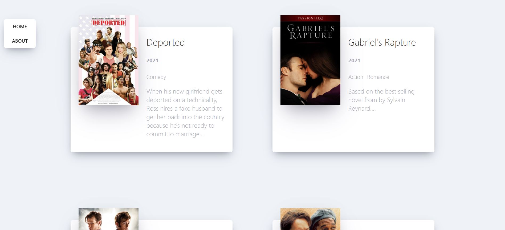

# 리액트 기초 : 클론 코딩 영화 평점 웹서비스

노마드코더의 [Do it! 클론 코딩 영화 평점 웹서비스](http://www.yes24.com/Product/Goods/90344496)를 가지고 리액트 기초를 다집니다. 

## 🎬 결과물

👉 [https://coodingpenguin.github.io/react-basic](https://coodingpenguin.github.io/react-basic)




## 👩‍💻 공부 일지

- [3장. 리액트 기초 개념 알아보기](#3장-리액트-기초-개념-알아보기)
- [4장. 슈퍼 똑똑하게 컴포넌트 만들기](#4장-슈퍼-똑똑하게-컴포넌트-만들기)
- [5장. state와 클래스형 컴포넌트](#5장-state와-클래스형-컴포넌트)
- [6장. 영화 앱 만들기](#6장-영화-앱-만들기)
- [7장. 영화 앱 다듬기](#7장-영화-앱-다듬기)
- [8장. 영화 앱에 여러 기능 추가하기](#8장-영화-앱에-여러-기능-추가하기)
- [Appendix. GitHub에 배포하기](#appendix-github에-배포하기)

### 3장. 리액트 기초 개념 알아보기
- 리액트는 `src` 폴더 안에 있는 코드를 자바스크립트로 컴파일한 결과물을 `index.html`에 렌더링한다.
- `ReactDOM.Render()`의 첫 번째 인자는 **컴포넌트(Component)**, 두 번째 인자는 렌더링할 위치이다.
- 리액트는 컴포넌트와 함께 동작하고 리액트 앱은 모두 컴포넌트로 구성된다.
- **JSX**는 HTML과 자바스크립트를 조합한 문법이다. 이 문법으로 컴포넌트를 정의한다. 이 때 컴포넌트의 이름은 **대문자**여야 한다.
- 리액트는 최종으로 단 한 개의 컴포넌트만 렌더링한다. (컴포넌트는 계층 구조를 갖을 수 밖에 없다.)
- **props**는 컴포넌트로 넘어가는 매개변수이다. 문자열인 경우를 제외하고 모두 `{}`로 감싸주어야 한다.

### 4장. 슈퍼 똑똑하게 컴포넌트 만들기

- `arr.map(func)`는 arr의 원소를 func에 넣어 그 반환값을 모아 배열 형태로 반환한다.
- 리액트의 컴포넌트는 유일한 `key` prop를 가져야 한다. (같은 컴포넌트 여러개의 컴포넌트) 왜냐하면 리액트는 컴포넌트가 서로 다르다는 것을 알 방법이 없기 때문이다.
- 이 때, `key` props는 리액트 내부에서 사용되는 특수한 props로 컴포넌트로 직접 전달되지 않는다.
- *prop-types*는 컴포넌트가 전달받은 props가 정말 내가 원하는 값인지 확인해준다.

### 5장. state와 클래스형 컴포넌트

- **state**는 <u>클래스형 컴포넌트</u>에서 사용되며, 동적 데이터를 다룬다.
- 클래스형 컴포넌트가 되려면 `React.Component`를 상속받아야 한다.
- 함수형 컴포넌트는 `return`으로, 클래스형 컴포넌트는 `render()` 함수가 JSX를 반환한다. 이 때 리액트는 클래스형 컴포넌트의 `render()` 함수를 자동으로 실행시킨다.
- **state**의 값을 변경하기 위해서는 `setState()`를 사용해야 한다. 즉, 직접 변경할 수 없다.
- 컴포넌트의 생명 주기는 다음과 같다.
    - `constructor()` 함수를 호출해 객체(컴포넌트)가 생성된다.
    - `render()` 함수를 호출해 JSX를 화면에 렌더링한다.
    - 렌더링이 끝나고 `componentDidMount()`를 호출한다.
    - 만약 **state**의 값이 변경된다면 즉, `setState()` 함수가 실행된다면 `componentDidUpdate()`를 호출한다.
    - 컴포넌트가 화면에서 떠나면 `componentWillUnmount()` 함수가 호출된다.

### 6장. 영화 앱 만들기

- `fetch` 대신 *axios*를 사용하여 API를 호출한다.
    - `fetch`는 서버에 네트워크 요청을 보내고 정보를 받아오는 일을 한다. 자세한 건 [모던 자바스크립트 fetch 문서](https://ko.javascript.info/fetch) 참조
    - *axios*는 Node.js를 위한 HTTP 비동기 통신 라이브러리이다.
- `axios.get()` 함수에 URL을 전달하여 API를 호출할 수 있다.
- *axios*는 네트워크를 이용하기에 정보를 다 받기까지 기다려야한다. 이를 구현하기 위해 `async`와 `await`를 사용한다.
    - `async`는 함수 앞에 붙여서 자바스크립트에게 이 함수가 <u>비동기 함수</u>임을 알려준다.
    - `await`는 함수 내에 기다릴 필요가 있는 부분에 붙여서 해당 줄이 끝날 때까지 기다린다.
- **state**가 필요하지 않으면 함수형 컴포넌트로, **state**가 필요하면 클래스형 컴포넌트로 작성한다.
- API에 구현된 기능을 잘 활용하자. 예를 들면, 어떤 값을 기준으로 정렬하는 것.
- 리액트에서 *class* 속성을 사용하기 위해서는 *className*을 써야한다. 나중에 리액트가 JSX를 HTML로 변환할 때 이 *className*을 *class*로 바꾸기 때문.

### 7장. 영화 앱 다듬기

- `map()`함수에 전달할 함수의 2번째 인자에는 `map()` 함수가 반복 실행하며 반환할 배열 원소의 인덱스가 자동으로 들어간다.
- `slice(start, end)`로 start부터 end-1까지 문자열을 자를 수 있다.

### 8장. 영화 앱에 여러 기능 추가하기
- 라우터는 URL에 맞게 화면 이동을 시켜주는 장치이다. 이를 *react-router-dom* 패키지로 쉽게 구현할 수 있다.
- **Route**에 <u>URL을 위한 path props</u>와 <u>URL에 맞는 component props</u>를 전달할 수 있다. 즉, URL을 보고 그에 맞는 컴포넌트를 화면에 그린다.
- 라우터는 가장 위에서 아래로 내려가면서 **path props**가 있는지 찾는다.
    - 예를 들어 `/about/cs`에 접속하면, 가장 상위 path인 `/`부터 `/about`, `/about/cs` 순으로 path props를 찾는다. 
    - 이 때의 component props를 해당 순으로 렌더링하게 된다.
- 위의 문제를 고치고 싶다면 **exact props**를 `true`로 하여 <u>path props와 정확히 일치하는 URL에만 반응</u>하도록 한다.
- `<a>`의 *href* 속성은 페이지 전체를 다시 그리기 때문에 `<Link>` 컴포넌트를 사용하면 페이지 전체가 새로 고침되지 않는다.
    - `<Link>`와 `<Route>` 컴포넌트는 무조건 `<HashRouter>` 컴포넌트 안에 있어야 작동한다. 
    - `<Link>`의 *to* 속성을 사용하여 어떤 URL로 갈지, 그 때 그려지는 컴포넌트에 어떤 props를 넘겨줄지를 정할 수 있다.
- **route props**는 라우팅 대상이 되는 컴포넌트에 넘겨주는 기본 props를 말한다.
    - **route props**의 `history` 안에는 push, go, goBack, goForward와 같이 URL을 변경해주는 함수들이 들어있다.
    - `push`는 지정된 URL로 이동을 시켜준다.

### Appendix. GitHub에 배포하기
- `package.json`에 hompage 키와 키값을 browerlist 아래에 추가한다.
- `package.json`의 scripts 키값에 다음을 추가한다.
```
{
    scripts: {
        ...
        "predeploy": "npm run build",
        "deploy": "gh-pages -d build",
    }
}
```
- GitHub에 코드를 업로드하고 *gh-pages* 패키지를 설치한다.
- `npm run deploy`를 입력하여 사이트를 배포한다.
